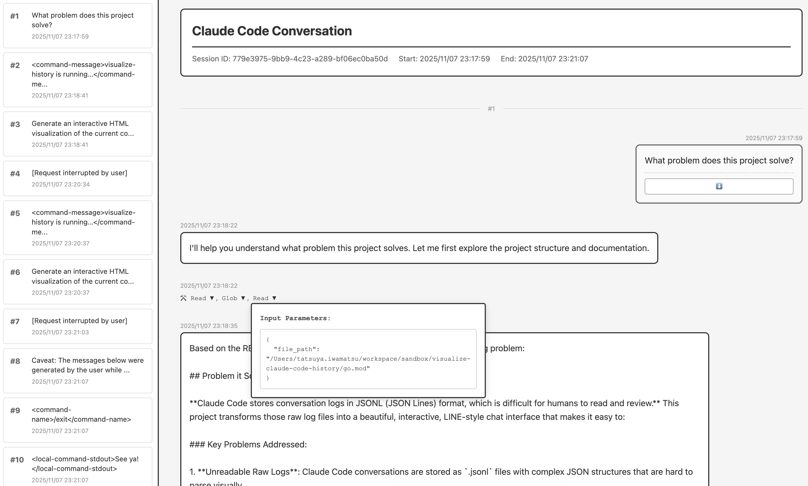

# Claude Code Conversation Visualizer

A tool to visualize Claude Code conversation logs (JSONL format) in an interactive chat-style interface.



## Features

- Display Claude Code conversations in a modern chat interface
- Toggle button to show/hide Claude's thinking process
- Display used tools (Read, Glob, Grep, etc.) below each message
- Expandable tool input parameters and results
- Timestamp display
- Sidebar table of contents (TOC) for jumping to user messages
- Navigate between messages (previous/next message)
- Special display for session continuation messages
- Output as a single HTML file (CSS and JavaScript embedded)

## Requirements

- Go 1.25+

## Build

```bash
go build -o visualize-conversation ./cmd/visualize-conversation
```

## Usage

### Basic Usage

```bash
# Auto mode: Visualize the latest conversation from the current project
./visualize-conversation

# Specify output directory
./visualize-conversation <output-directory>

# Explicitly specify input file and output directory
./visualize-conversation <input.jsonl> <output-directory>
```

### Use as Slash Command

Since `.claude/commands/visualize-conversation.md` is included, you can run it from within Claude Code with:

```
/visualize-conversation
```

### Arguments and Priority

The output directory is determined by the following priority:

1. **CLI argument**: `./visualize-conversation ./custom-output`
2. **Environment variable**: `VISUALIZE_OUTPUT_DIR=./custom ./visualize-conversation`
3. **Default**: `./dist`

### Examples

```bash
# Default output (./dist/index.html)
./visualize-conversation

# Change output directory with environment variable
VISUALIZE_OUTPUT_DIR="./output" ./visualize-conversation

# Visualize a specific session
./visualize-conversation ~/.claude/projects/your-project/session-id.jsonl ./output

# Custom output directory
./visualize-conversation ./my-output
```

After execution, `<output-dir>/index.html` will be generated. Open this HTML file in a browser to view the conversation visualization.

## Project Structure

```
.
├── cmd/
│   └── visualize-conversation/
│       └── main.go                 # CLI entry point
├── internal/
│   └── parser/
│       ├── parser.go               # JSONL parser
│       ├── generator.go            # HTML generation logic
│       ├── types.go                # Type definitions
│       └── assets/
│           ├── styles.css          # CSS styles
│           └── script.js           # Frontend functionality
├── .claude/
│   └── commands/
│       └── visualize-conversation.md # Slash command definition
├── go.mod
├── visualize-conversation          # Compiled binary
└── README.md
```

## HTML Features

The generated HTML includes the following features:

1. **Thinking Process Display**: Click the "🧠 ..." button to expand Claude's internal thinking process (hidden by default). Multiple thinking blocks are grouped together and separated by dividers
2. **Tool Details Display**: Click on a tool name to expand input parameters and execution results
3. **TOC Navigation**: Jump to any user message from the table of contents in the left sidebar
4. **Message Navigation**: Navigate to previous/next messages with buttons below each user message
5. **Scroll to Top Button**: Return to the top with the "↑ Top" button displayed at the bottom of the page
6. **Responsive Design**: Readable design on mobile devices

## Auto Session Detection

When run without arguments, it automatically detects the Claude Code project from the current project directory and visualizes the latest conversation log.

Detection logic:
1. Get the current working directory
2. Search for the corresponding project directory in `~/.claude/projects/` (Exact Match → Fuzzy Match)
3. Use the latest `.jsonl` file (excluding agent-*) in the project directory

## Customization

### Modifying CSS/JavaScript

To change colors or layout, edit the files under `internal/parser/assets/` and rebuild:

```bash
# Edit CSS/JS
vi internal/parser/assets/styles.css
vi internal/parser/assets/script.js

# Rebuild
go build -o visualize-conversation ./cmd/visualize-conversation
```

### Environment Variable Configuration

To change the default output directory, set an environment variable:

```bash
# Add to .bashrc, .zshrc, etc.
export VISUALIZE_OUTPUT_DIR="$HOME/Documents/claude-visualizations"
```

## Installation

To make it available system-wide:

```bash
# Install to /usr/local/bin
sudo cp visualize-conversation /usr/local/bin/

# Or use Go install
go install ./cmd/visualize-conversation
```

## License

MIT
